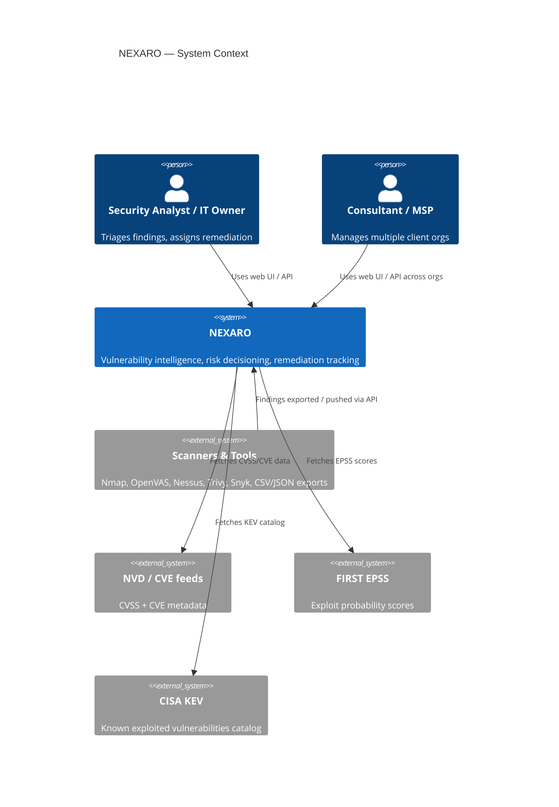
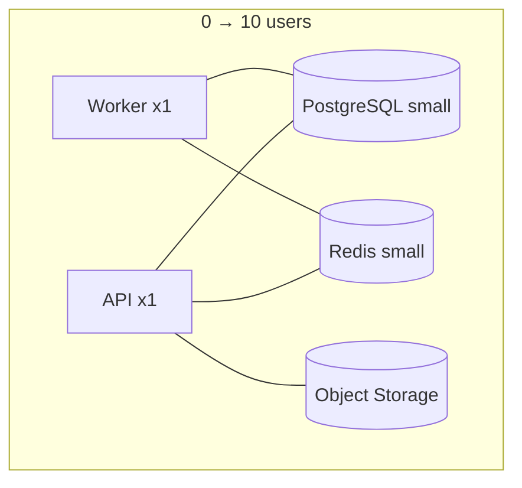
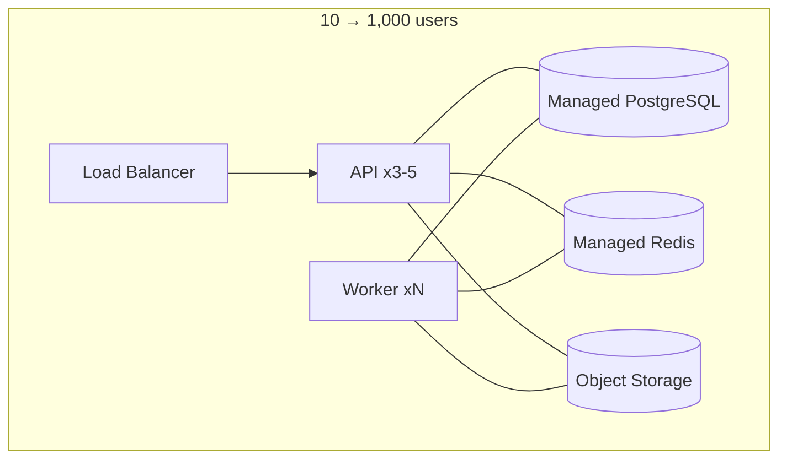

# NEXARO — Architecture

## 1. Style: Modular Monolith

**Decision:** one deployable backend (API + worker share one codebase), internally divided into modules with enforced boundaries. See [ADR-001](../adr/ADR-001-modular-monolith.md).

Rejected alternative: microservices. For a single developer serving up to 1,000 users, microservices add deployment surface, distributed-transaction complexity, and operational burden with no corresponding benefit — the scale target (Section 17 of the brief) is reachable by scaling compute for one well-factored monolith. ARGOS is kept as an internally-independent module specifically so it *can* be extracted into its own service or public API later without a rewrite (see [ADR-006](../adr/ADR-006-argos-risk-model.md)).

## 2. System context



## 3. Container architecture

```
                       INTERNET
                          │
                          ▼
                   REVERSE PROXY
                          │
             ┌────────────┴────────────┐
             │                         │
             ▼                         ▼
        NEXARO WEB                 NEXARO API
      React / Vite                  FastAPI
                                       │
                           ┌───────────┼───────────┐
                           ▼           ▼           ▼
                      PostgreSQL     Redis    Object Storage
                           │           │
                           │           ├── jobs
                           │           ├── cache
                           │           └── rate limits
                           │
                           ▼

                      ASYNC WORKERS
                           │
              ┌────────────┼─────────────┐
              ▼            ▼             ▼
           Imports       ARGOS         Reports
```

- **NEXARO WEB** — static React/Vite bundle served behind the reverse proxy; talks to the API only, computes nothing (Section 22).
- **NEXARO API** — stateless FastAPI process. No important state lives in process memory (Section 23); every request is independently routable to any API instance.
- **ASYNC WORKERS** — same codebase, different entrypoint, consuming jobs from Redis. Handle imports, ARGOS enrichment, and report generation — anything that shouldn't block an HTTP request.
- **PostgreSQL** — single source of truth for all durable state.
- **Redis** — job queue, cache (ARGOS intelligence, hot lookups), and distributed rate limiting. Never the source of truth.
- **Object Storage** (S3-compatible) — uploaded scanner files, generated reports, evidence attachments.

## 4. Module map

```
backend/nexaro/
├── identity/        # users, auth, sessions, API keys
├── organizations/    # orgs, memberships, RBAC
├── assets/           # assets, services
├── vulnerabilities/  # CVE records — owned by ARGOS
├── findings/          # findings, evidence, fingerprinting
├── imports/           # upload handling, parsers, import jobs
├── risk/              # ARGOS: CVSS/EPSS/KEV intelligence + Vulnerability Risk
├── decisions/          # Decision Engine: Organizational Priority
├── remediation/        # remediation lifecycle
├── verification/        # verification lifecycle
├── reports/              # report generation
└── audit/                # append-only audit log
```

Each module (Section 94) declares:
- **Owned entities** — tables it is the only writer of.
- **Public service/API** — the Python interface other modules may call.
- **Events emitted** — internal events other modules may subscribe to (Section 95).
- **Dependencies** — modules it is allowed to import from.
- **Forbidden dependencies** — modules it must never import from directly.

### Dependency rules

```
identity            → (no internal deps)
organizations       → identity
assets              → organizations
risk (ARGOS)        → (no org/user/billing deps — see below)
findings            → organizations, assets, risk
imports             → findings, assets, risk
decisions           → risk, findings, assets, organizations
remediation         → findings, decisions, organizations
verification        → remediation, findings
reports             → findings, decisions, remediation, organizations
audit               → (write-only sink; every module may emit to it, nothing depends on it)
```

**Forbidden:** any module importing from `web`; `risk` (ARGOS) importing from `identity`, `organizations`, or anything billing-related (Section 7) — this is what keeps ARGOS extractable as an independent engine/API later; `findings` writing directly to another module's tables instead of calling its public service.

### Internal events (Section 95)

Simple in-process/DB-transactional events, not an event-sourcing system:

```
FindingCreated · FindingEnriched · PriorityChanged
RemediationRequested · VerificationFailed
```

Consumers (e.g. audit logging, report cache invalidation) subscribe within the same monolith. No message broker is introduced for this — Redis-backed jobs already exist for anything that must survive a process restart (Section 3 of this doc; [docs/JOBS_AND_IMPORTS.md](JOBS_AND_IMPORTS.md)).

## 5. Deployment architecture





**Same code, both diagrams.** Scaling from 10 to 1,000 users is: add API instances behind the load balancer, add worker instances, size up managed Postgres/Redis, keep object storage as-is. See [docs/SCALABILITY.md](SCALABILITY.md) and [docs/DEPLOYMENT.md](DEPLOYMENT.md).

## 6. Source tree

```
nexaro/
├── apps/
│   ├── api/            # FastAPI app entrypoint
│   ├── web/             # React/Vite app
│   └── worker/           # worker entrypoint (same backend code, different runner)
├── backend/
│   └── nexaro/            # module map above
├── migrations/              # Alembic
├── tests/
├── load-tests/                # k6 scripts
├── docs/
├── adr/
├── docker/
└── scripts/
```

This tree is illustrative, not sacred (Section 93) — it may be adjusted once implementation starts if a cleaner layout emerges, without changing the module boundaries above.

## 7. Why not X

| Rejected | Reason | Would reconsider if |
|---|---|---|
| Microservices | Operational cost > benefit at 1,000-user scale for a 1-developer team | A specific module (e.g. ARGOS) needs independent scaling/deployment cadence proven by metrics |
| Kubernetes | No benefit demonstrated for this load; adds a full ops discipline | Benchmarks show container orchestration needs (autoscaling, multi-region) that docker-compose/managed PaaS can't meet |
| Kafka / event sourcing | No use case requires a durable event log beyond what Postgres + Redis jobs provide | A downstream system needs to replay a full event history independently of NEXARO's own state |
| CQRS | Adds a second model and sync problem for no proven read/write scale mismatch | Read load on findings/dashboards is shown (by metrics) to require a separate read model |
