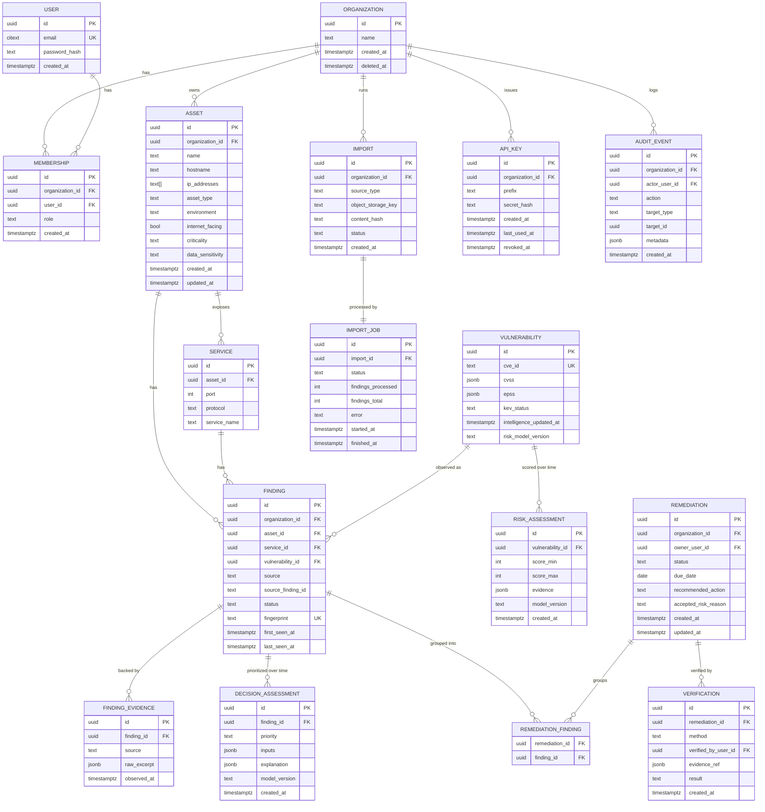

# NEXARO — Data Model

PostgreSQL is the source of truth (Section 42). No sharding, no per-organization databases in V1. Designed for millions of rows in `findings`, hundreds of thousands in `vulnerabilities`, and up to a million `assets`.

## 1. ERD (core entities)

## 2. Keys and constraints

- All tenant-scoped tables carry `organization_id NOT NULL` with an `ON DELETE RESTRICT` FK to `Organization` (see [docs/MULTITENANCY.md](MULTITENANCY.md) — deletion is handled explicitly, never cascaded silently).
- `Vulnerability.cve_id` — unique. `Vulnerability` has no `organization_id`: it is global, owned by ARGOS.
- `Finding.fingerprint` — unique **per organization** (`UNIQUE (organization_id, fingerprint)`), the deduplication key described in [docs/JOBS_AND_IMPORTS.md](JOBS_AND_IMPORTS.md#deduplication).
- `Membership` — unique `(organization_id, user_id)`.
- `APIKey.secret_hash` — never the raw secret; the raw value is shown once at creation (Section 50).
- Money/measurement fields (`UsageEvent.billable_units`, etc., defined in [docs/API_SPEC.md](API_SPEC.md)) use integer/decimal types, never floats.

## 3. Index strategy (Section 43)

Derived from actual query patterns, not applied indiscriminately:

| Table | Index | Serves |
|---|---|---|
| `finding` | `(organization_id, status)` | Findings list filtered by status — the most common query. |
| `finding` | `(organization_id, asset_id)` | Asset detail → its findings. |
| `finding` | `(vulnerability_id)` | "Which orgs/assets are affected by CVE-X" (ARGOS re-scoring fan-out). |
| `finding` | `UNIQUE (organization_id, fingerprint)` | Deduplication on write. |
| `finding` | `(organization_id, last_seen_at)` | Staleness / "not seen recently" queries. |
| `asset` | `(organization_id)` | Base tenant scoping — implied by most queries, still needs the leading index. |
| `import` | `(organization_id, created_at)` | Import history list. |
| `audit_event` | `(organization_id, created_at)` | Audit log browsing — append-heavy, range-scanned. |
| `risk_assessment` | `(vulnerability_id, created_at)` | Latest score / score history for a CVE. |
| `decision_assessment` | `(finding_id, created_at)` | Latest priority / priority history for a finding. |

Every index above is justified by a named query in [docs/API_SPEC.md](API_SPEC.md) or [docs/JOBS_AND_IMPORTS.md](JOBS_AND_IMPORTS.md). New indexes require the same justification before being added (Section 43: "no indexes indiscriminately").

## 4. Pagination

All large collections (`findings`, `assets`, `audit_event`, `usage_event`) use **cursor pagination** keyed on `(created_at, id)` or `(last_seen_at, id)`, never offset pagination — offset pagination degrades badly past a few hundred thousand rows and is unstable under concurrent writes. Contract detailed in [docs/API_SPEC.md](API_SPEC.md#pagination).

## 5. Query budget

Interactive endpoints have a stated maximum query count, enforced by an instrumentation-based test (Section 45):

| Endpoint | Budget |
|---|---|
| `GET /findings?limit=50` | ≤ 3 queries (list + count-estimate + N/A joins via `selectinload`, not per-row) |
| `GET /findings/{id}` | ≤ 5 queries (finding + vulnerability + asset + latest decision + evidence) |
| `GET /dashboard/summary` | ≤ 6 queries, all aggregate, no per-row fan-out |

N+1 avoidance is a CI-enforced test, not a code-review hope — see [docs/TEST_STRATEGY.md](TEST_STRATEGY.md#integration-tests).

## 6. Retention & deletion (Sections 107–108)

| Data | Retention (V1 default) | Deletion mechanism |
|---|---|---|
| Raw import files (object storage) | 90 days, then deleted | Scheduled job; metadata row (`Import`) retained |
| `FindingEvidence` raw excerpts | Retained while the parent `Finding` exists | Cascades with `Finding` soft-delete |
| `AuditEvent` | Retained indefinitely in V1 (append-only, low volume relative to findings) | Never hard-deleted except full org deletion |
| `RiskAssessment` / `DecisionAssessment` history | Retained indefinitely — this is the "why did priority change" record | Never deleted except full org/vulnerability deletion |
| `Report` outputs | 1 year, then deleted from object storage | Scheduled job |
| `UsageEvent` | 13 months (covers annual billing review) | Scheduled job |

`Organization` deletion: **soft delete** (`deleted_at` set, access revoked immediately) with a 30-day recovery window, then a scheduled **hard delete** job cascades through owned tables and object storage. `Asset`/`Finding` deletion follows the same soft→hard pattern so accidental deletes are recoverable. `NEEDS_HUMAN`: exact retention numbers above are defaults for design purposes and should be confirmed against applicable privacy/contract obligations before commercial launch.

## 7. What's minimized (Section 109)

NEXARO stores security metadata, asset data, and business context — not general PII. The only personal data in the core model is `User.email` (login identity) and `Membership.role`/audit actor references. No customer end-user data, no unrelated business records.
