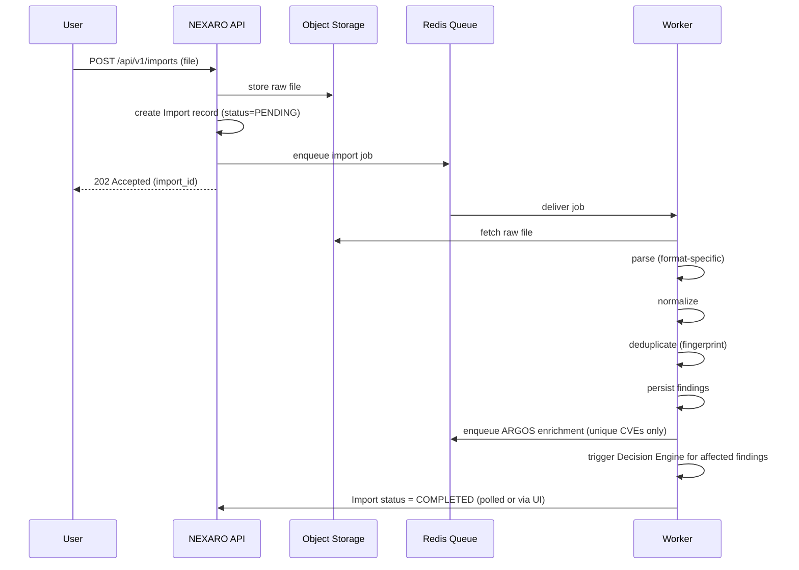
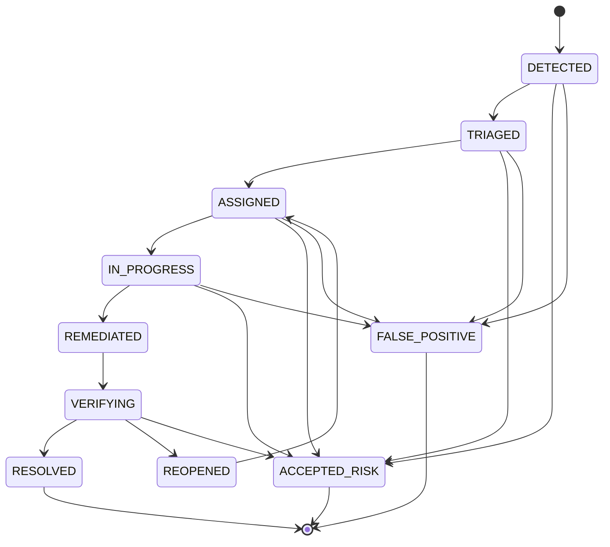

# NEXARO — Jobs, Imports & Remediation Lifecycle

## 1. Job system choice

**Decision:** Redis + **Dramatiq**. See [ADR-003](../adr/ADR-003-redis-jobs-cache-ratelimit.md) for the Redis role split (jobs/cache/rate-limit) and the option analysis below.

| Option | Retry | Scheduled jobs | Visibility | Failure handling | Operational cost |
|---|---|---|---|---|---|
| Celery | Mature | Mature (beat) | Mature (Flower) | Mature | High — separate beat process, broker/result-backend config surface, historically fragile at small scale |
| RQ | Basic (manual backoff) | Needs `rq-scheduler` add-on | Good (RQ Dashboard) | Basic | Low |
| **Dramatiq** | **Built-in, with backoff** | Simple periodic actors, no separate beat process | Good (admin/middleware) | **Built-in retry middleware + dead-letter handling** | **Low** |

Dramatiq is chosen: it satisfies retry, scheduling, visibility, and failure handling out of the box with the smallest number of moving parts — no separate scheduler process to run and monitor, unlike Celery. RQ was close but its retry/backoff story needed more manual code for the import/enrichment resilience this system needs (Section 66 — bounded retries on every external call). Kafka is explicitly rejected (Section 35) — there is no streaming/replay requirement here, only a task queue.

## 2. Idempotency

Jobs must be safely retryable without duplicating results (Section 36):
- **Imports**: identified by `(organization_id, content_hash)` of the uploaded file. Re-processing the same import is a no-op past the point already reached — findings are upserted by `fingerprint`, never blindly inserted.
- **ARGOS enrichment**: upserts `Vulnerability`/`RiskAssessment` keyed by `cve_id` — re-running enrichment for a CVE already at the current `model_version` and fresh data is a cheap no-op.
- **Reports**: idempotent by `(organization_id, report_type, params_hash)` within a time window, to avoid duplicate generation from a retried job.

## 3. Import pipeline



The HTTP request never blocks on parsing (Section 34). The endpoint always responds `202 Accepted` with an `import_id` the client polls or subscribes to for progress (`ImportJob.findings_processed` / `findings_total`).

## 4. Supported formats and rollout order (Section 33)

```
Generic CSV / JSON → Nmap XML → OpenVAS → Nessus
```

Each format gets its own parser behind a common `ImportParser` interface producing a normalized intermediate representation before deduplication — adding a new format never touches the dedup/enrichment/decision stages.

## 5. Deduplication

**Fingerprint** — a stable hash over the inputs that define "the same observation":

```
fingerprint = hash(organization_id, asset_identity, cve_id, port, protocol, service_context)
```

This distinguishes:
- The same CVE on the same asset (→ **one** `Finding`, updated `last_seen_at`, evidence appended).
- The same CVE on a different asset (→ a **different** `Finding`).

Multiple scanners reporting the same underlying observation attach as additional `FindingEvidence` rows on the **same** finding rather than creating duplicate findings:

```
Finding: CVE-X on Server-1
  Evidence: Nessus (2026-08-01)
  Evidence: OpenVAS (2026-08-10)
```

`asset_identity` resolution (matching a scanner's notion of a host to an existing `Asset`) is itself a defined, testable step — `ASSUMPTION`: V1 matches on hostname first, then IP address, and creates a new `Asset` only when neither matches; `VERIFY` this against real scanner export samples during Phase 3 implementation.

## 6. ARGOS enrichment at scale

Never enrich per finding:

```
100,000 findings
      ↓
  6,200 unique CVEs   (dedup before enrichment)
      ↓
 ARGOS cache lookup
      ↓
only stale/missing CVEs refreshed from NVD/EPSS/KEV
```

Not `100,000 × N` external requests. The import job extracts the distinct set of `vulnerability_id`s touched, and enrichment jobs are enqueued once per distinct CVE not already fresh in the ARGOS cache (Redis-backed, with PostgreSQL as the durable snapshot — see [docs/RISK_MODEL.md](RISK_MODEL.md#3-provenance)).

## 7. Global timeouts (Section 66)

Every external call (NVD, EPSS, KEV) has:
```
connect_timeout   bounded
read_timeout        bounded
retries               bounded, with backoff (Dramatiq retry middleware)
task deadline          bounded — a stuck enrichment job cannot run forever
```
On exhausted retries, the affected `Vulnerability` intelligence field is marked stale/unknown rather than the job retrying indefinitely — this directly feeds the uncertainty model in [docs/RISK_MODEL.md](RISK_MODEL.md#2-uncertainty-unknown--zero).

## 8. Remediation lifecycle



`REMEDIATED → RESOLVED` is unreachable directly (Section 54) — it must pass through `VERIFYING`. V1 verification methods (Section 55): manual evidence upload, a new scanner import that no longer shows the finding, rescan evidence, or an asset state update. Every verification records **who** and **when** (`Verification.verified_by_user_id`, `created_at`).

## 9. Organization limits (Section 52)

Enforced via Redis-backed counters, configurable per plan later:

```
max concurrent imports / org        (ASSUMPTION default: 2)
max upload size                      (ASSUMPTION default: 250 MB)
max findings per import               (ASSUMPTION default: 100,000 — matches capacity target)
max concurrent imports, platform-wide  (target: 20, per Section 17)
max report jobs / org / hour
API rate per org
```
`VERIFY` these defaults against real customer scanner export sizes before locking them in.
