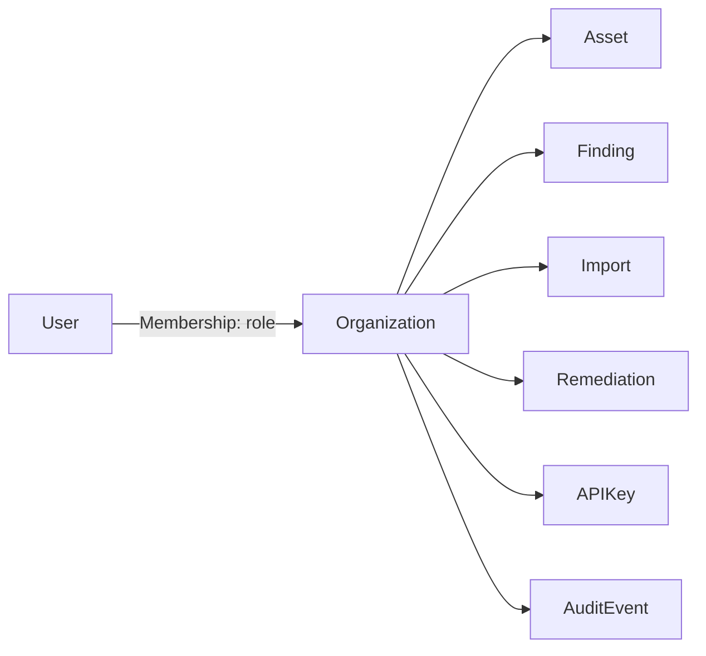

# NEXARO — Multi-Tenancy

## 1. Tenant unit

The **Organization** is the tenant boundary (Section 24). See [ADR-005](../adr/ADR-005-multitenancy-strategy.md).



A `User` is global (one login, e.g. a consultant), and can hold a `Membership` (with a role) in multiple organizations — this directly serves the MSP/consultant persona from [docs/PRODUCT_SPEC.md](PRODUCT_SPEC.md#4-personas), who manage several client orgs from one login.

## 2. Isolation strategy

**Decision:** single PostgreSQL database, shared schema, `organization_id` on every tenant-scoped row — not database-per-tenant, not schema-per-tenant.

Rejected alternatives:
- **Database-per-org**: operationally infeasible at 250+ orgs for a single developer (250+ connection pools, migrations run 250+ times, backup/restore multiplied). Explicitly ruled out (Section 42: "no multiple databases per organization").
- **Schema-per-org**: reduces but doesn't eliminate the migration multiplication problem, and Postgres schema-per-tenant at this scale still adds real operational complexity for no isolation benefit over row-level scoping done correctly.

Row-level scoping, enforced in code and tested explicitly, is the simplest approach that meets the actual isolation requirement at this scale (Section 42, Section 112 — "toda nueva tecnología es un coste de mantenimiento").

## 3. Enforcement layers (Section 25)

Isolation is never trusted from a single layer:

1. **Application layer** — every repository/query function for a tenant-scoped entity requires an `organization_id` argument; there is no code path that queries `Finding`/`Asset`/etc. without it. This is enforced by code convention **and** by the query-layer pattern below, not left to individual endpoint authors to remember.
2. **Database query layer** — every tenant-scoped table has `organization_id` as the leading column in its primary access indexes ([docs/DATA_MODEL.md](DATA_MODEL.md#3-index-strategy)), and the base query-builder/repository layer injects the `WHERE organization_id = :org_id` clause centrally rather than per call site — a missing filter is a code-review-visible anomaly, not a silent possibility.
3. **Tests** — dedicated cross-tenant access tests are mandatory, not optional (Section 87, detailed in [docs/TEST_STRATEGY.md](TEST_STRATEGY.md#tenant-isolation-tests)).

**Never** the pattern:
```
GET /findings/{id}
SELECT * FROM findings WHERE id = ?          -- WRONG: no organization check
```
**Always**:
```
GET /findings/{id}
SELECT * FROM findings WHERE id = ? AND organization_id = :acting_org_id
```
Not found or wrong org → `404` (Section 25, and [docs/SECURITY_MODEL.md](SECURITY_MODEL.md#3-authorization)). The client cannot distinguish "doesn't exist" from "exists in another org."

The **acting organization** is derived from the authenticated session or API key, never accepted as an unvalidated client-supplied value — the client may select which of *their* orgs they're acting as, but the server resolves that selection against the caller's actual memberships before using it as `acting_org_id`.

## 4. RBAC (Section 26)

```
OWNER    — full control, including billing/danger-zone actions (org deletion, ownership transfer)
ADMIN    — manage users, assets, findings, remediation, imports, API keys
ANALYST  — triage findings, manage remediation/verification, run imports
VIEWER   — read-only
```

Kept intentionally simple — a fixed 4-role table, not a general permission engine (Section 26: "no construir un permission engine arbitrario inicialmente"). If V2 needs finer-grained permissions, that's a deliberate, separately-justified expansion, not a default.

## 5. Isolation tests (Section 87)

Mandatory test pattern, run in CI for every tenant-scoped resource type:

```
User in Org A attempts to GET/PATCH/DELETE a Finding/Asset/Remediation/etc. belonging to Org B
  → expect 404 (or 403 where existence is intentionally not hidden, per docs/SECURITY_MODEL.md)

User in Org A attempts to create a resource referencing an Org B asset_id/vulnerability_id where cross-org reference is invalid
  → expect 400/404, not silent cross-tenant linkage
```

Covered explicitly: `Asset`, `Finding`, `Import`, `Remediation`, `Verification`, `APIKey`, `Report`, `AuditEvent`. Detailed in [docs/TEST_STRATEGY.md](TEST_STRATEGY.md).

## 6. Noisy-neighbor protection

Per-org limits (concurrent imports, upload size, findings/import, API rate — [docs/JOBS_AND_IMPORTS.md](JOBS_AND_IMPORTS.md#9-organization-limits)) prevent one tenant's activity from degrading others, since all tenants share one database and job queue. This is validated under load via the 250-org/1,000-user scale test in [docs/TEST_STRATEGY.md](TEST_STRATEGY.md#tenant-scale-test).
