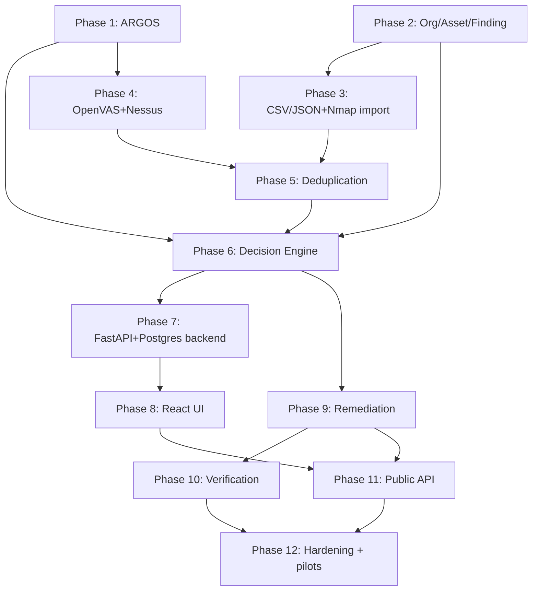

# NEXARO — Roadmap & Definition of Done

## 1. Definition of V1 (Section 117)

V1 is done when an external user can, **without developer intervention**:

```
create organization
  ↓
add/import assets
  ↓
import findings
  ↓
normalize
  ↓
deduplicate
  ↓
enrich with ARGOS
  ↓
add asset/business context
  ↓
receive explainable priority
  ↓
assign remediation
  ↓
provide remediation evidence
  ↓
verify resolution
  ↓
generate report
```

This is the acceptance test for V1 — a single loop, self-service, end to end.

## 2. Implementation phases (Section 116)

```
Phase 1   ARGOS stable                          (docs/RISK_MODEL.md)
Phase 2   Organizations, Assets, Findings         (docs/DOMAIN_MODEL.md, docs/MULTITENANCY.md)
Phase 3   CSV/JSON + Nmap import                    (docs/JOBS_AND_IMPORTS.md §4)
Phase 4   OpenVAS + Nessus import
Phase 5   Deduplication                                (docs/JOBS_AND_IMPORTS.md §5)
Phase 6   Decision Engine                                (docs/DECISION_ENGINE.md)
Phase 7   FastAPI + PostgreSQL SaaS backend                (docs/API_SPEC.md, docs/ARCHITECTURE.md)
Phase 8   React UI                                            (docs/UX_SPEC.md)
Phase 9   Remediation                                            (docs/JOBS_AND_IMPORTS.md §8)
Phase 10  Verification
Phase 11  Public API                                                (docs/API_SPEC.md)
Phase 12  Hardening + pilots                                          (docs/TEST_STRATEGY.md, docs/SCALABILITY.md)
```

### Dependency graph



`ASSUMPTION`: Phase 7 (backend SaaS scaffolding — auth, multi-tenancy, API framework) can start in parallel with Phases 1–2 rather than strictly after, since it's largely orthogonal infrastructure; the dependency graph above shows the *logical* data dependency, not a forced sequencing. `VERIFY` actual sequencing against real velocity once implementation starts — a single developer may prefer standing up the backend shell first.

## 3. Suggested 12-month pacing (illustrative, not contractual)

| Months | Phases | Milestone |
|---|---|---|
| 1–2 | 1, 2 | ARGOS scoring real CVEs; org/asset/finding schema live with tenant isolation tests passing |
| 3 | 3 | First real scanner import (CSV/JSON, Nmap) working end to end into stored findings |
| 4 | 5, 6 | Dedup + Decision Engine producing explainable priorities on imported data |
| 5 | 7 | Public-shaped REST API (even if UI isn't done) with auth/RBAC/rate limiting |
| 6–7 | 8 | Web UI covering the full loop through prioritization |
| 8 | 4, 9 | OpenVAS/Nessus import; remediation tracking |
| 9 | 10 | Verification lifecycle closes the loop — Definition of V1 (§1) is reachable |
| 10 | 11 | Public API hardened for external/customer use |
| 11–12 | 12 | Load/data-scale/tenant-scale gates (docs/SCALABILITY.md, docs/TEST_STRATEGY.md) passed; first pilot customers |

## 4. Quality gates before calling V1 "scale-ready" (Section 118, 120)

```
load tests passed          (docs/SCALABILITY.md §5)
data-scale tests passed        (docs/TEST_STRATEGY.md §7)
tenant tests passed                (docs/MULTITENANCY.md §5)
async import test passed              (docs/TEST_STRATEGY.md §9)
DB query review passed                    (docs/DATA_MODEL.md §5)
resource metrics documented                    (docs/OBSERVABILITY.md)
```

## 5. Pilot criteria

A pilot customer is ready to onboard once: the Definition of V1 loop (§1) works self-service, tenant isolation tests are green, at least Gate B (50 concurrent users, [docs/SCALABILITY.md](SCALABILITY.md#5-load-gates)) is passing, backups are restore-tested ([docs/OBSERVABILITY.md](OBSERVABILITY.md#5-backups)), and the security baseline in [docs/SECURITY_MODEL.md](SECURITY_MODEL.md) is implemented (not just designed).

## 6. Technical risks

| Risk | Impact | Mitigation |
|---|---|---|
| Real-world scanner exports don't match assumed formats/fields cleanly | Import pipeline rework mid-project | Validate parsers against real sample exports early (Phase 3), not just spec-derived fixtures |
| Asset-identity matching (hostname/IP heuristics) produces false merges/splits | Bad deduplication → wrong priorities | Treat as its own tested unit (`docs/JOBS_AND_IMPORTS.md` §5), `VERIFY` against real data before Phase 5 is called done |
| NVD/EPSS/KEV API changes or rate limits | ARGOS enrichment degrades | Uncertainty model (`docs/RISK_MODEL.md` §2) already designed to degrade gracefully, not silently |
| One-developer bandwidth vs. 12-phase scope | Timeline slip | Phasing is dependency-ordered so a slip delays later phases without leaving the product in a broken intermediate state |
| Underestimated query patterns at scale | Missed index → slow endpoint at 1M+ rows | Data-scale tests (`docs/TEST_STRATEGY.md` §7) run before, not after, a scale claim is made |

## 7. Open questions (`VERIFY` during implementation)

- Exact asset-identity matching heuristic (hostname vs. IP precedence) — `docs/JOBS_AND_IMPORTS.md` §5.
- Whether `Remediation` needs true many-to-many grouping of findings in V1 or can start 1:1 — `docs/DOMAIN_MODEL.md` §3.
- Default organization limit values (upload size, findings/import, EPSS staleness threshold, KEV refresh interval) — currently `ASSUMPTION` defaults scattered through `docs/JOBS_AND_IMPORTS.md` and `docs/RISK_MODEL.md`; confirm against real usage once there is any.
- Exact retention windows in `docs/DATA_MODEL.md` §6 — defaults for design purposes only.

## 8. `NEEDS_HUMAN` decisions (Section 133 — not blocking technical design)

```
Pricing and plan tiers (Free/Solo/Starter/Pro/Team/MSP/API — docs/PRODUCT_SPEC.md §8)
Licensing / open-core structure (Section 100) — separate ADR when this becomes live
Cloud provider selection for managed Postgres/Redis/object storage/container hosting (docs/DEPLOYMENT.md §2)
Production budget and hosting cost ceiling
Legal terms, privacy policy, data processing agreements
Brand decisions beyond the product-language guidance in docs/PRODUCT_SPEC.md §7
Commercial launch timing and pilot customer selection
Whether NEXARO's repo should be split out of portfolio-mrabeh (nexaro/PHASE_0_FINDINGS.md)
```

None of these block finishing the technical design or starting implementation of Phases 1–2.

## 9. Explicitly out of V1, tracked as future roadmap only (Section 16)

```
SIEM · SOAR · EDR · full scanner · cloud CNAPP · CSPM · ASM platform
full GRC · full compliance suite · attack graph · attack-path engine
mobile apps · ML risk model · generative-AI core decisions
100 integrations · multi-region · Kubernetes · Kafka · service mesh
CQRS · event sourcing
SSO/OAuth (deferred per docs/SECURITY_MODEL.md §2)
Fine-grained/custom permission engine beyond the 4 fixed RBAC roles (docs/MULTITENANCY.md §4)
Billing provider integration (domain is prepared, not wired — docs/PRODUCT_SPEC.md §8)
```

Nothing in this list is reconsidered for V1 without a specific, demonstrated need — per the anti-overengineering check: *"Does NEXARO need this to serve 1,000 users, or does it merely look like architecture for 100,000?"*
